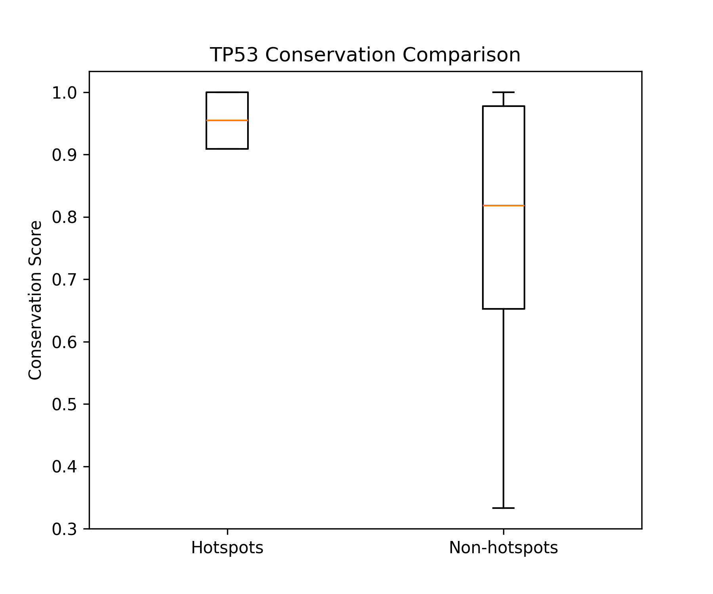
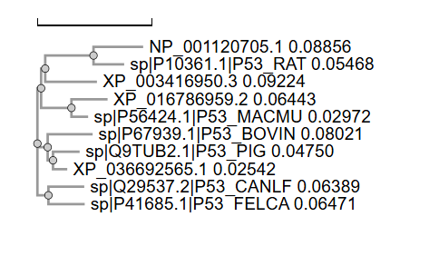

# Evolutionary Conservation of TP53 Mutation Hotspots

## Status
- Preprint available (Research Square)
- Under consideration at Scientific Reports

## Overview
This project investigates evolutionary conservation patterns of TP53 mutation hotspot residues across mammalian species using comparative bioinformatics approaches.

## Key Results
- Hotspot residues show higher conservation (~0.95) than non-hotspot (~0.78)
- Statistically significant difference (p = 0.034)
- Hotspots localized within conserved DNA-binding domain

## Dataset
- 10 mammalian TP53 protein sequences
- Sources: UniProt (P04637), NCBI Protein database

## Methods
1. Multiple Sequence Alignment (Clustal Omega)
2. Conservation scoring (frequency-based)
3. Statistical testing (Mann–Whitney U)
4. Visualization (Matplotlib)

## Repository Structure
```
data/        → sequence data  
scripts/     → analysis code  
results/     → figures + tables  
notebook/    → reproducible workflow  
docs/        → manuscript  
```

## Reproducibility

```bash
pip install -r requirements.txt
python scripts/conservation_analysis.py
python scripts/statistical_test.py
```

## Figures

### Conservation Analysis


### Multiple Sequence Alignment


### Phylogenetic Tree


## Preprint
[ADD YOUR RESEARCH SQUARE LINK HERE]

## Author
Ritika Rajendra Rawat  
MSc Bioinformatics  

## License
MIT
